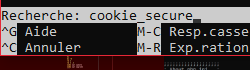

# <p style="color: red"> Installation GLPI

## <p style="color: red"> 1 - Préparation

- RAM 4096
- CPU * 1
- Connexion bridge (externe)
- Disque 25 Go

<p style="color: blue"> Extensions à installer sur VSCode : 

- Markdown All in One 
- Markdown Preview Enhanced
- Markdown Preview Mermaid Support
- Peacock
- Remote - SSH
- Remote - SSH: Editing Configuration Files
- Remote Explorer
- VSLook

Type 1 |
---------|
 Operating System |
 Hypervisor |
 Hardware |

Dans la console:

```bash
ip a
sudo apt update
sudo apt upgrade
```

Vérifier que le host communique avec la VM
```bash
ping 192.168.0.142
```

Sur la VM, installer openSSH-server et configurer firewall: (Def ufw : uncomplicated firewall = firewall pas compliqué)

```bash
sudo apt install openssh-server
sudo ufw status
sudo ufw enable
sudo ufw allow 22
sudo ufw allow 80
sudo ufw allow 443
sudo ufw status
```
Sur le host :
```bash
ssh aka@192.168.0.243
```
Par la suite, quand le serveur sera en "glpi.local" on pourra faire la commande suivante dans le cmd :
```bash
ssh aka@glpi.local
```

## <p style="color: red"> Vérification serveur web - apache 2

```bash
sudo systemctl status apache2
sudo apt install apache2 php libapache2-mod-php php-mysql
sudo systemctl status apache2
```
### <p style="color: blue"> Préparation des dossiers et fichiers
```bash
cd /var/www
ls
ls -l
sudo mkdir glpi
cd glpi
sudo mkbir public
cd ..
pwd
sudo chown -R aka:aka glpi
ls -l
cd /etc/apache2
cd sites-available/
ls -l
cat 000-default.conf
sudo nano glpi.conf
```
Faire un copier coller de l'installation vhost dans le terminal après la commande sudo nano 

### <p style="color: green"> Installation vhost - virtual host

```bash
<VirtualHost *:80>
    ServerName glpi.local
    ServerAlias www.glpi.local

    DocumentRoot /var/www/glpi/public

    # If you want to place GLPI in a subfolder of your site (e.g. your virtual host is serving multiple applications),
    # you can use an Alias directive. If you do this, the DocumentRoot directive MUST NOT target the GLPI directory itself.
    # Alias "/glpi" "/var/www/glpi/public"

    <Directory /var/www/glpi/public>
        Require all granted

        RewriteEngine On

        # Ensure authorization headers are passed to PHP.
        # Some Apache configurations may filter them and break usage of API, CalDAV, ...
        RewriteCond %{HTTP:Authorization} ^(.+)$
        RewriteRule .* - [E=HTTP_AUTHORIZATION:%{HTTP:Authorization}]

        # Redirect all requests to GLPI router, unless file exists.
        RewriteCond %{REQUEST_FILENAME} !-f
        RewriteRule ^(.*)$ index.php [QSA,L]
    </Directory>
</VirtualHost>
```
Après avoir mit ce texte dans le terminal.

Il faut que l'adresse IP de la VM corresponde à glpi.local, c'est à dire que 192.168.0.243 deviendra glpi.local. Il faut donc faire une ligne de commande pour que ça le devienne.

<p style="color: purple"> Sortir de VI, il faut appuyer sur échap, mettre ":q!" et faire entrer.

<p style="color: green"> Sur le pc physique, aller dans disque C , Windows , System32, drivers, etc.
Ouvir le fichier hosts avec vs code.


Cmd poste physique pour tester le ping : 

```bash
ping glpi.local
ping www.glpi.local
```
Repartons sur la vm :
(Via le cmd du poste physique en notant préalablement : ssh aka@192.168.0.243)

```bash
cd /var/www/glpi
ls -l
cd public/
ls
cd
cd /var/www
ls -l
cd glpi
cd public/
echo "Hello World" > index.html
cat index.html
cd
pwd
echo "Bonjour" > toto.txt
ls
cat toto.txt
echo "Buenos dias" >> toto.txt
cat toto.txt
ls -l
cat toto.txt
rm toto.txt
```

Après les lignes de commande , appuyer ici :


connect to host , mettre l'ip de la vm, mettre le mdp faire entrer, ensuite ce sera écrit "home/aka" appuyer sur entrée, remettre le mdp.
New file qu'on nommera "glpi.conf" et copier dans ce nouveau fichier la config du dessus:


```bash
cd /etc
cd apache2/
ls -l
cd sites-available/
ls
sudo cp /home/aka/glpi.conf .
ls -ltr
sudo a2ensite glpi.conf
```

Si la dernière commande ne fonctionne pas : 
```bash
sudo systemctl status apache2.service
cd mods-enabled/
sudo a2enmod
sudo systemctl status apache2
cd /etc/apache2/sites-available/
sudo vi glpi.conf
```
Il manquait le virtual host qui était au début, la fin du texte, il fallait écrire VirtualHost (entre crocher <>)

```bash
sudo systemctl restart apache2
cd /var/log
cd apache2
ls
ls -l
ls -ltr
cat error.log
```

Chemin pour aller dans les doc : 
Cliquer en bas à gauche de VS CODE, ensuite se connecter a l'ip, (enlever /home/aka) /var/www/glpi/public/index.html
créer un nouveau fichier sur le plus dans le public, qui se nommera index.php.


```bash
<?php
echo "Hello World";
phpinfo();
```

Pour redémarrer glpi s'il ne fonctionne pas ( si l'apache ne fonctionne pas)
```bash
-> Pour savoir qu'est ce qui bloque 
(en l'occurence c'est apache2 mais 
voici la commande pour le savoir) : 
sudo systemctl status glpi

sudo systemctl start apache2
sudo systemctl restart apache2
sudo systemctl status apache2
```
### <p style="color: red"> Installation des modules : 

Regarder la doc glpi pour voir ce qui nous manque sur le site suivant : 
https://glpi-install.readthedocs.io/en/latest/prerequisites.html


```bash
cd /vr/www/glpi/public
ls
cat index.html
rm index.html
nano vi index.php
```
 Pour trouver la version de php : 

 ```bash
php --version
```
Vérifications des fichiers et installation des php manquants : 

Ici présent il me manquait: 
gd,dom,simplexml,xmlreader,xmlwriter,curl,intl,bz2 et zip.

<p style='color: grey'>On effectuera une dernière commande après celles ci dessous qui va restart le glpi.local (sur lequel on vérifie si on a bien tout les php comme le demande le site suivant : https://glpi-install.readthedocs.io/en/latest/prerequisites.html)


```bash
sudo apt-get install -y php-gd
sudo apt-get install -y php-dom
sudo apt-get install -y php-simplexml
sudo apt-get install -y php-xmlreader
sudo apt-get install -y php-xmlwriter
sudo apt-get install -y php-curl
sudo apt-get install -y php-intl
sudo apt-get install -y php-bz2
sudo apt-get install -y php-zip
sudo systemctl restart apache2
```
### <p style="color: red"> Installation des paramêtres de sécurité : 

```bash
sudo find / -name "php.ini"
cd /etc/php/8.1/apache2
ls -l
sudo nano php.ini
```


Modification à faire afin de mettre "on" :




"Ctrl+w" = recherche : cookie_secure
Enlever la virgule du début et mettre espace "on" derrière "=".


"ctrl + o" et "entrée"
"ctrl + w" recherche : httponly
Mettre sur "on"  :


"ctrl + o" et "entrée"
"ctrl + w" recherche : 
cookie_samesite
Mettre sur "Lax" (L maj) : 


"ctrl + o" et "entrée"
"ctrl + x"

Vérifier que MySQL fonctionne : 
Taper dans l'invite de commande ceci : sudo systemctl status mysql.service


Si vous l'avez, c'est très bien, si vous ne l'avez pas il faudra effectuer les étapes suivantes pour l'installer : 

### <p style="color: blue"> Installation de MySQL

On vérifie le listing des paquets puis les installer :

```bash
sudo apt update
sudo apt upgrade
```
Bien faire "O" pour que l'installation se fasse

Faire ensuite cette commande pour installer MySQL :
```bash
sudo apt install mysql-server mysql-client
```
Vérifier si ça s'est bien installé :
```bash
sudo systemctl status mysql.service
```


Pour vérifier la version : 
```bash
mysql --version
sudo mysqladmin version
```


MySQL admin a une fonction qui n'existe nulle part ailleurs, par exemple, si on perd son mot de passe de connexion.
```bash
mysqladmin --help
```


```bash
cd /etc/mysql
ls -l
cd mysql.conf.d
ls -l
sudo nano mysqld.cnf
```


Paramétrâge à effectuer :
Mettre bind address ET mysqlx-bind-address sur : 0.0.0.0 (comme exemple, il faut mettre l'ip du serveur apache à la place des "0")


## <p style="color: red"> Installation glpi fichier tar/tgz

```bash
cd /tmp
wget https://github.com/glpi-project/glpi/releases/download/10.0.15/glpi-10.0.15.tgz
```

Vérifier que le fichier est au bon endroit avec ces commandes :
```bash
cd /var/www
ls -l
```


Décompresser le fichier : 
```bash
cd /tmp
sudo tar -xzvf glpi-10.0.15.tgz -C /var/www/
ls -l
```
aka (moi) est propriétaire partout, il faut que mtn ce soit "apache" le propriétaire de chacun des fichiers :


Changement de propriétaire :
```bash
sudo chown -R www-data:www-data *
ls -l (vérifier que ça fonctionne)
```


Ouvrir firefox et taper : http://glpi.local

Commande à tapper dans le cmd pour vérifier les log quand la connexion au site n'est pas possible ou bloque : 
```bash
cd /var/log
cd apache2
ls -ltr (pour voir la liste des log, les derniers changements se mettent sur les dernières lignes)
tail access.log (tail permet de voir ce qu'il y a dans le dossier directement)
```


POST = répondre à un formulaire
GET = pour lire une page WEB


Code |
---------|
 200 : tout a bien marcher |
 418 : erreur "je suis une théière" |
 404 : erreur 404 "page not found" |
 403 : authentification required |
 500 : internal server error |
 

```bash
cd /var/www/glpi/install
ls -ltr
sudo nano install.php
```

```bash
cd etc/php/8.1
ls
cd apache2/
ls
sudo vi php.ini
```
Suite a la commane "sudo vi php.ini"
Faire "/" et écrire "cookie", appuyer sur la touche "n" pour pouvoir arriver jusqu'à "cookie secure" le mettre en off.


Après avoir fait cela, enregisrer et quitter la page et faire la commande restart : 
```bash
sudo systemctl restart apache2
```
## <p style="color: red"> Création d'un compte pour MySQL
```bash
sudo mysql
show databases;
```


```bash
create database glpi;
show databases;
create database 
CREATE USER 'glpi'@'localhost' IDENTIFIED BY 'greta';
GRANT ALL PRIVILEGES ON glpi.* TO 'glpi'@'localhost' WITH GRANT OPTION;
```


```bash
FLUSH PRIVILEGES;
exit (quitte le mysql revient au cmd de base)
```
Vérifier que la base de données qu'on a créée est fonctionnel.
```bash
mysql -u glpi -p
use glpi;
show tables;
```


On retourne sur firefox, sur le glpi.local : 


On rentre : localhost , glpi, et le mdp.
Ensuite on choisit "glpi" et on fait suivant.
On suit la procédure après les actions faites ci dessus.


## <p style="color: red"> Sécurité MySQL

Pr défaut, MySQL donne un user du nom de "root" et aucun mdp lié à celui-ci. Il faut donc désactiver "root" et créer un nouvel admin avec un mot de passe sécurisé. Ceci est très important à faire car tout les hackers savent que root est l'user par défaut sans mdp.
N'installez pas glpi en tant que root, JAMAIS !!
C'est dangereux de laisser en "root" il faut absolument le supprimer et en créer un nouveau.

<p style="color: gray">
- Créer un admin par exemple "dba". <p style="color: red">[PAS LORSQU'ON SE TROUVE EN LOCAL EVIDEMMENT]
<p style="color: gray">
- Créer un user applicatif du nom de "glpi" par exemple ou "lipg" (ou autre bien sûre). Lui mettre le minimum de droit sur glpi.


### <p style="color: red"> HORS COURS :

TIPS : 

CLI = command line interface

SITE POUR POSER TES QUESTIONS : Gemini

Sortir de "vi" :
esc:q!

Arrêter la VM :
```bash
sudo halt
```

Libérer l'espace de VSCODE :
```bash
cd .vscode-server/
ll
du
du -h
rm *
rm * .*
sudo apt update
sudo apt upgrade
```

Pour supprimer tout les messages d'erreurs : 
```bash
find / -type f -size +100M 2>/dev/null
```

Pour supprimer une commande : 
```bash
sudo rmdir public
```

Voir l'espace disque : 
```bash
df -h
```

Si l'accés ssh me dit que c'est refusé : 
```bash
sudo service ssh status
```

Commande pour faire planter le pc : 
```bash
cat fork.sh
```

Rechercher un document sur linux :

```bash
find . -name 'crack*' -print
```

Afficher un fichier page par page : 
-> less <-
```bash
cd /usr/share/dict
less cracklib-small (permet de voir la liste des mots de passe qui ont déjà été cracké)
ls ltr
less french (dictionnaire)
less british-english
cat README.select-wordlist
cat american-english | wc -l
cat american-english | grep -v "'s" | wc -l
```

Si l'ip n'est pas bonne sur le réseau ou pour la renouveler : 
```bash
sudo dhclient -r -v eth0
sudo dhclient -v eth0
```

Pour vérifier que le ssh est bien actif : 
```bash
ps -ef | grep ssh
```
